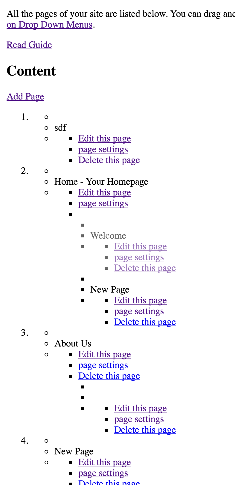
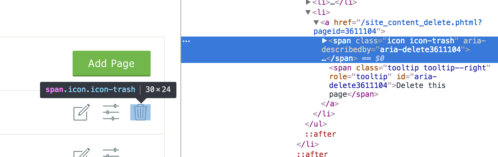
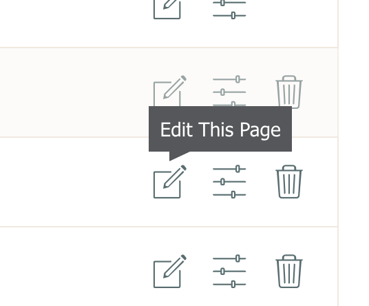
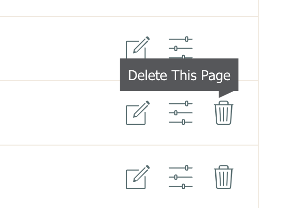

I was recently implementing a new set of icons for edit, or delete an item or to change its settings.
The icons were to use an icon font and replace images that were not really very easy to understand.
The icons had a title attribute that would show (on some browsers) when hovered but they weren't all that useful either.
It struck me that this is a case where accessibility isn't just about disability, the icons were hard for everyone to understand.

For that reason, I wanted to add some tooltips that would display on hover.
I also wanted the tooltips to be accessible to screen readers.

## How I did

I started with the markup and progressively enhanced it from there.
You can see here that the HTML makes sense without any CSS.



The relevant aria role attributes have been added to give screen readers an idea of what the elements are doing.



The first level of enhancement was CSS. The tooltip is hidden and then displayed when the icon is hovered, using the `.icon:hover + .tooltip` selector.
The tooltip is positioned above the icon like so;

```css
.icon {
  position: relative;
}
.tooltip {
  position: absolute;
  left: -9999 px;
  opacity: 0;
}
.icon:hover + .tooltip {
  left: 0;
  opacity: 1;
}
```

and the arrow is added as an after element using the 'CSS triangle' technique;

```css
.tooltip:after {
  content: '';
  display: block;
  position: absolute;
  width: 0;
  height: 0;
  bottom: -6.5px;
  left: 15px;
  border-top: 7.5px solid #56575a;
  border-right: 15px solid transparent;
}
```



The trouble with how the tooltips are positioned is that if the screen is not wide enough, it will cut off the tooltip text.
To get around this I saw no other way other than to add to javascript.

Enhancement step 2;

The JS works out the screen width, and the position of the tooltips furthest most right edge.
If the tooltips edge position is bigger than the bodys right position, its overflowing.
A class is added to the tooltip and CSS is used to swing the tooltip the other way.
It's calculated on every hover incase the screen size changes.



The javascript also helped solve the problem of how touch devices deal with hover states. Without the javascript, the first touch would display the tooltip, preventing the link from working. Now, the tooltip is shown as a brief flash when tapped but the link is still followed. It needs some work as this flash is confusing but I feel its nicer than the double tap required before.

## Update:

Since publishing this post two things have changed;

1. I tested the tooltips with a screen reader and realised that they were not being read out due to the way in which I was hiding them. Its important to actually test the code your right for screen readers, with a real screen reader!
2. We've stopped using icon fonts and are now outputting SVG's for the icons. This should make the markup even more semantic.
